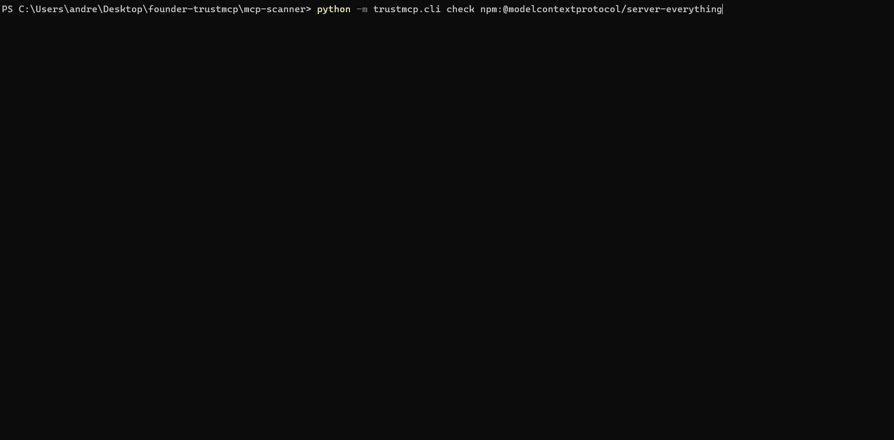

# trustmcp

[](https://pypi.org/project/trustmcp/)
[](https://pypi.org/project/trustmcp/)
[](https://pypi.org/project/trustmcp/)
[](https://github.com/v0idw4lker/trustmcp/actions/workflows/ci.yml)

`trustmcp` scans MCP (Model Context Protocol) servers, the layer AI agents like Claude, ChatGPT, and Cursor use to call external tools, and grades them A through F. Feed it source code, a running server, or both. Findings land straight in GitHub's Security tab via SARIF, no extra plumbing required.

Want semantic analysis, cross-server toxic-flow detection, and continuous monitoring? That's the premium tier: [join the waitlist](https://trustmcp.netlify.app).



---

## ✅ Prerequisites

Needs [Python 3.10 or newer](https://www.python.org/downloads/) and a terminal open in the folder holding the MCP server you want to scan (`cd path/to/my-mcp-server`).

---

## ⚡ Quick Installation

```bash
# Direct execution without installation (recommended)
uvx trustmcp@latest scan --path . --mode static

# Or permanent installation
pip install trustmcp
trustmcp scan --path . --mode static
```

**Static scan only** (source code, no running server required):

```bash
trustmcp scan --path ./my-mcp-server --mode static
```

**Full scan** (static + live dynamic analysis + auth posture + unified score + SARIF):

```bash
trustmcp scan --path ./my-mcp-server --mode both \
  --target "stdio:python3 server.py" \
  --target "url:http://127.0.0.1:8931/mcp"
```

Outputs a color-coded console report (via `rich`), a `mcp-scan-report.json`, and a `mcp-scan-report.sarif`. Drop the SARIF into CI and GitHub picks it up automatically under Security > Code scanning.

| Flag              | What it does                                                                          |
| ----------------- | -------------------------------------------------------------------------------------- |
| `--path`          | Directory to statically scan and to search for auth-posture evidence (default `.`)     |
| `--mode`          | `static`, `dynamic`, or `both` (default `both`)                                        |
| `--target`        | Live MCP server to scan dynamically. Repeatable. `stdio:<command>` or `url:<url>`      |
| `--no-fuzz`       | Disables tool input fuzzing during dynamic analysis                                    |
| `--json-output`   | Path for the JSON report (default `mcp-scan-report.json`)                              |
| `--no-json`       | Do not write a JSON report                                                             |
| `--sarif-output`  | Path for the SARIF report (default `mcp-scan-report.sarif`)                            |
| `--no-sarif`      | Do not write a SARIF report                                                            |
| `--fail-on`       | Exit non-zero if a finding at/above this severity exists: `low`/`medium`/`high`/`critical` (CI gating) |
| `-v`, `--verbose` | Verbose logging                                                                        |

### `trustmcp check`: scan a server BEFORE you install it

`scan` covers what's already on disk. `check` goes further: point it at an npm package, a PyPI package, a GitHub repo, or an official MCP registry `server.json`, and it resolves the reference, downloads the source into an isolated temp directory, and scans it **before `npm install` or `pip install` ever runs**. Nothing in the package executes. No install scripts, no import, no build step. Just download, extract, read.

```bash
# npm (scoped names are handled automatically)
trustmcp check npm:@modelcontextprotocol/server-everything

# PyPI, pinned to a specific version
trustmcp check pypi:some-mcp-server==0.3.0

# GitHub, default branch resolved automatically
trustmcp check github:owner/repo

# An official MCP registry server.json record
trustmcp check https://registry.modelcontextprotocol.io/v0/servers/some-server/server.json
```

On top of the same static and auth-posture checks `scan` runs, `check` adds signals that only matter pre-install: package age and days since last publish, maintainer count (npm only, PyPI doesn't expose this, so it's reported as a known gap instead of a faked number), whether the manifest's repository URL actually resolves, and whether `package.json` declares a `preinstall`/`postinstall`/`install` script, the classic way supply-chain attacks run code automatically on `npm install`. The report leads with a one-line verdict: `Grade D. Do not install without reviewing tools/exec.py:44 first.`

| Flag              | What it does                                                                          |
| ----------------- | -------------------------------------------------------------------------------------- |
| `--offline`       | Refuse any network access; fail clearly instead of hanging                             |
| `--timeout`       | Network timeout in seconds for registry lookups and the download (default `30`)        |
| `--max-size`      | Maximum download size in MB; aborts if exceeded (default `50`)                         |
| `--json-output`   | Path for the JSON report (default `mcp-check-report.json`)                             |
| `--no-json`       | Do not write a JSON report                                                             |
| `--sarif-output`  | Path for the SARIF report (default `mcp-check-report.sarif`)                           |
| `--no-sarif`      | Do not write a SARIF report                                                            |
| `--fail-on`       | Exit non-zero if a finding at/above this severity exists: `low`/`medium`/`high`/`critical` (CI gating) |
| `-v`, `--verbose` | Verbose logging                                                                        |

> 🔗 **Want SARIF results showing up automatically in your GitHub Security tab?** See [examples/github-actions.md](examples/github-actions.md) for the one-line composite Action and the manual CI setup.

---

## 🎯 What It Detects

Four modules, all free, always combined into one score.

| Module                | What it checks                                                                                                                                                                                                        |
| ---------------------- | ------------------------------------------------------------------------------------------------------------------------------------------------------------------------------------------------------------------ |
| **Static** (source code) | `eval`/`exec`, `os.system`/`os.popen`, `subprocess(shell=True)`, unsafe `pickle`/`yaml.load`, path traversal, hardcoded secrets (OpenAI, Anthropic, GitHub, AWS, Stripe, Google, Slack, JWTs, a generic prefixed-credential heuristic, PEM keys), hidden/obfuscated Unicode (zero-width, bidi-control, and Unicode Tag "ASCII smuggling" characters), **prompt-injection patterns in `@tool`/`@resource`/`@prompt` descriptions and docstrings** (pseudo-tags, concealment directives, role-spoofing lines), **runtime mutation of a tool's `__doc__`/`description` after definition** (the "rug pull" mechanism), MCP config exposed on `0.0.0.0`, unpinned or known-vulnerable dependencies (`requirements.txt` and `package.json`) |
| **Dynamic** (live server) | Tool/resource/prompt enumeration, authentication enforcement (401/403 vs. 200), TLS/HSTS for remote servers, live description drift vs. source code, and **input fuzzing** (malformed payloads sent to every discovered tool, to catch crashes and stack-trace/error leakage) |
| **Auth posture**       | Detects whether a server appears to implement OAuth 2.1, a static API key, or an environment-variable token, and flags weak or missing mechanisms                                                                  |
| **Scoring**             | A-F grade, with findings explicitly mapped to the **OWASP MCP Top 10**                                                                                                                                              |

### OWASP MCP Top 10 Coverage

Mapped to the official categories, not an invented taxonomy:

- `MCP01:2025` Token Mismanagement & Secret Exposure
- `MCP02:2025` Privilege Escalation via Scope Creep
- `MCP03:2025` Tool Poisoning
- `MCP04:2025` Software Supply Chain Attacks & Dependency Tampering
- `MCP05:2025` Command Injection & Execution
- `MCP07:2025` Insufficient Authentication & Authorization
- `MCP10:2025` Context Injection & Over-Sharing

Findings without a clear match are **not** forced into a category. See [`trustmcp/core/scoring.py`](trustmcp/core/scoring.py).

---

## 🔇 Suppressing findings

Suppress a specific finding with an inline comment, the same convention most linters use (`# noqa`, `# pylint: disable=...`):

```python
os.system(cmd)  # trustmcp: ignore[static.os-system]

# trustmcp: ignore[static.path-traversal-open-param]
with open(user_path) as f:
    ...

eval(user_input)  # trustmcp: ignore   <- suppresses every rule on this line, not just one
```

- `# trustmcp: ignore` suppresses **all** findings on that line.
- `# trustmcp: ignore[rule.id]` suppresses only the named rule; comma-separate several: `# trustmcp: ignore[static.os-system, static.dangerous-eval-exec]`.
- The comment is honored on the finding's own line, **or** the line immediately above it, which helps when the flagged line is long or auto-formatted.
- Works for AST-based findings in Python source, and for the line-based checks over `requirements.txt`, `mcp.json`/`manifest.json`, and `package.json` (in JSON files the comment is stripped before parsing, so it doesn't break `json.loads`).

Use it for confirmed false positives or accepted risk, not to silence findings you haven't actually looked at.

---

## 🔬 Honesty Over Marketing

> `confidence` is a heuristic per-rule prior (how specific and unambiguous the signature is), **not** a statistically measured false-positive rate. Calibration against known-vulnerable and clean MCP servers ran 2026-08-19, and again 2026-08-21. See [Validation](#-validation-dvmcp-benchmark) below.

The dependency list is a small, hand-curated set of notorious CVEs, checked entirely offline. It's **not** a substitute for `pip-audit`, `npm audit`, or [OSV.dev](https://osv.dev); trustmcp deliberately skips network calls in its core scan.

---

## 📊 Validation: DVMCP Benchmark

- **Canonical challenges (`server.py`): 6/10 fully detected, 1/10 partial, 3/10 missed**
- **As-deployed Docker containers (`server_sse.py`): 4/10 detected (2 off-label hits), 6/10 missed**
- **False positives: 0/3 clean servers**

Tested against [Damn Vulnerable MCP Server](https://github.com/harishsg993010/damn-vulnerable-MCP-server) (DVMCP), 10 intentionally vulnerable MCP servers, plus 3 clean official SDK example servers to catch false positives. DVMCP ships two independent implementations of most challenges, the documented `server.py` and the as-deployed `server_sse.py` Docker image, and they frequently diverge, so both get reported separately instead of picking whichever number looks better.

Full methodology, every per-challenge result (including the honest misses), the two DVMCP upstream bugs worked around just to run it, and one false positive the scanner itself produced on challenge 9 (not counted as a hit above): **[docs/validation.md](docs/validation.md)**.

---

## 🏢 Enterprise / SaaS Tier

Everything above is free and open source, permanently. It's a complete scanner on its own: static analysis, live dynamic probing with input fuzzing, authentication posture, unified scoring, and SARIF/JSON reporting.

The paid tier adds what a single, stateless scan can't do:

- **Semantic (LLM) analysis**: every tool/resource/prompt description goes to an LLM under a strict, conservatively calibrated rubric, catching what regex can't: naturally phrased hidden instructions, ambiguous scope, and language attempting to dictate model behavior.
- **Cross-server toxic-flow detection**: real agents connect multiple MCP servers at once. A file-reading server plus a network-calling server can form an exfiltration channel even though each looks harmless alone. Single-server scans can't see this, by definition.
- **Continuous monitoring**: a one-time scan can't catch a *rug pull*, a server that passes review cleanly, then changes its tool descriptions or scope after it's earned trust. That takes fingerprinting, a saved baseline, and drift alerting across scans over time.
- API access for CI/CD integration beyond static SARIF, and a verified, embeddable README badge for MCP registries.

The free tier's `trustmcp/core/plugins.py` already defines the extension point these plug into. The architecture supports them, they're just not distributed in this open-source package.

📩 Interested in early access? Open an [issue](https://github.com/v0idw4lker/trustmcp/issues) or contact [@v0idw4lker](https://github.com/v0idw4lker).

---

## 🧪 Quick Testing

```bash
git clone https://github.com/v0idw4lker/trustmcp
cd trustmcp
pip install -e ".[dev]"

# Static scan on this repo itself (fixtures/ is intentionally vulnerable)
trustmcp scan --path . --mode static

# Full pipeline against a fixture server
trustmcp scan --path . --mode both --target "stdio:python3 fixtures/target_server_stdio.py"

# Two fixture servers at once, a good demo of live multi-target scanning
trustmcp scan --path . --mode both \
  --target "stdio:python3 fixtures/vulnerable_server_a.py" \
  --target "stdio:python3 fixtures/vulnerable_server_b.py"
```

Scanning `.` also picks up the scanner's own source, so expect two real LOW findings in `trustmcp/reporters/json_reporter.py` and `sarif_reporter.py` for `open()` built from a path parameter. That's expected and already reviewed: the path comes from the CLI's own `--json-output`/`--sarif-output` flags, not external input.

### Running the test suite

```bash
pytest
```

---

## 🗺️ Roadmap

- [x] Published detection-rate + false-positive-rate validation against known-vulnerable and clean MCP server benchmarks, see [Validation](#-validation-dvmcp-benchmark) (2026-08-19, re-run 2026-08-21)
- [x] Pre-install scanning of registry references (`trustmcp check`): npm, PyPI, GitHub, and official registry server.json
- [ ] Complete OAuth 2.1 flow for authenticated dynamic scanning
- [ ] Semantic analysis, cross-server toxic-flow, and continuous monitoring (paid tier)
- [ ] Listing on `awesome-mcp-security` and official MCP registries

---

## Project Structure

```
trustmcp/
├── trustmcp/                   # installable package (the free tier)
│   ├── cli.py                   # entrypoint: `trustmcp scan --path ... --mode both`
│   ├── core/
│   │   ├── models.py           # shared Finding contract used by every module + reporter
│   │   ├── text_safety.py      # hidden/obfuscated Unicode detection (shared static + dynamic)
│   │   ├── static_analyzer.py  # AST/regex SAST, secrets, dependency auditing
│   │   ├── dynamic_client.py   # live MCP client (stdio/HTTP, enumeration, TLS/auth, fuzzing)
│   │   ├── auth_posture.py     # OAuth 2.1 / static key / env-var token detection
│   │   ├── registry_resolver.py # `check`: npm/PyPI/GitHub/server.json -> a downloadable tarball URL
│   │   ├── supply_chain.py     # `check`: pre-install-only signals (age, maintainers, install scripts, repo resolution)
│   │   ├── preinstall.py       # `check`: isolated download/extract + orchestrates static + auth-posture + supply-chain
│   │   ├── scoring.py          # A-F scoring engine + OWASP MCP Top 10 mapping
│   │   └── plugins.py          # extension point for premium modules (unused in the free tier)
│   ├── reporters/
│   │   ├── cli_reporter.py     # color-coded terminal report
│   │   ├── json_reporter.py    # structured JSON for CI/CD
│   │   └── sarif_reporter.py   # SARIF 2.1.0 export for GitHub Security
│   └── utils/                  # logging + exception hierarchy
├── fixtures/                   # intentionally vulnerable test MCP servers
├── tests/                      # pytest suite + clean/vulnerable fixture modules
└── premium/                    # LOCAL ONLY, gitignored (see "Enterprise / SaaS Tier" above)
```

---

## License

MIT. See [LICENSE](LICENSE).

Built by [@v0idw4lker](https://github.com/v0idw4lker).
